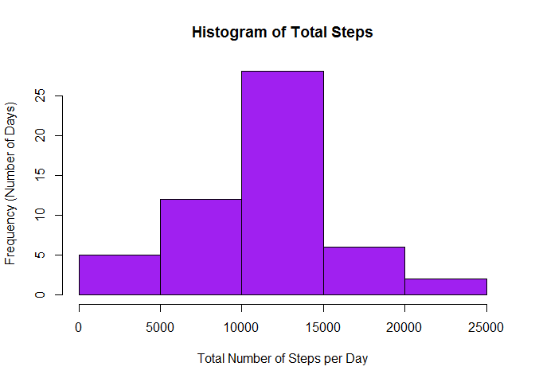
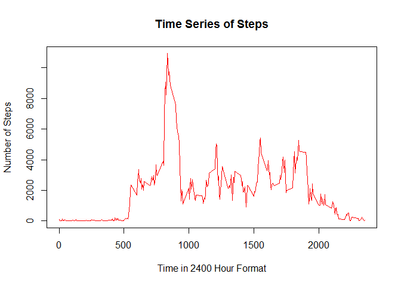
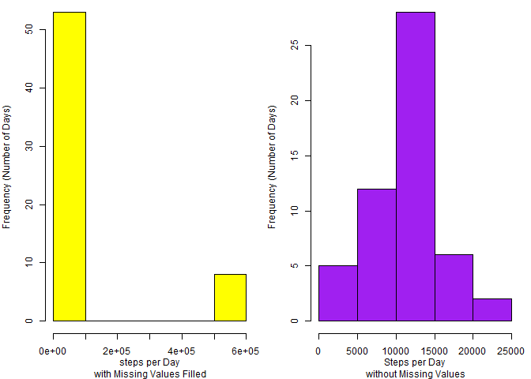
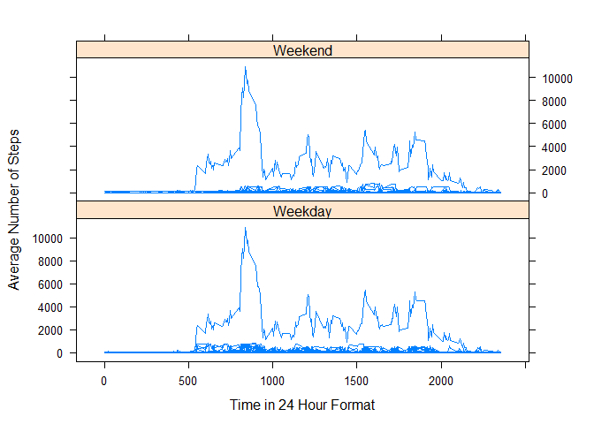

# Activity Monitoring
Yvette Janecek  
May 8, 2016  

##Reproducible Research Project 1

This project makes use of data from a personal activity monitoring device.  
This device collects data a five minute intervals throughout the day.  
The data consists of two months of observations from an anonymous individual collected 
during the months of October and November in 2012, and include the number of steps taken 
in five minute intervals each day.

This project will address the following questions. 

-What is the mean number of steps taken per day?

-What is the average daily activity pattern?

-What is the effect of imputing (replacing) missing values?

-Are there differences in activity patterns between weekdays and weekends?  


```r
library(dplyr)
```

```
## Warning: package 'dplyr' was built under R version 3.2.5
```

```
## 
## Attaching package: 'dplyr'
```

```
## The following objects are masked from 'package:stats':
## 
##     filter, lag
```

```
## The following objects are masked from 'package:base':
## 
##     intersect, setdiff, setequal, union
```

```r
library(lattice)
activity <- read.csv("activity.csv")  #read data
colnames(activity) <-c("Steps", "Date", "Time_Interval")  #edit column name
#colClasses(activity) <- c("numeric", "Date", "numeric")
#interval_hours <- activity$Time_Interval %/% 100 #interval divided by 100 without remainder
#interval_hours <- ifelse(interval_hours<10, paste("0", interval_hours, sep=""), interval_hours)
#interval_minutes <- activity$Time_Interval %% 100 #remainder of interval divided by 100
#interval_minutes <- ifelse(interval_minutes<10, paste("0", interval_minutes, sep=""), #interval_minutes)
#interval_time <- paste(interval_hours, interval_minutes, sep=":") #change interval to time format
#interval_time <- strptime(interval_time, format="%H:%M")
#activity$Time_Interval <- interval_time
activity_wona <- na.omit(activity)    #read data without NAs
```
First is a graph showing the frequency of steps.  
The higher bars of the graph indicate the total number of steps that where most often reached in a day.


```r
steps_day <- aggregate(Steps ~ Date, activity_wona, sum)
hist(steps_day$Steps, col="purple", main="Histogram of Total Steps", 
     xlab="Total Number of Steps per Day", ylab="Frequency (Number of Days)")
```

<!-- -->


```r
mean_steps <- mean(steps_day$Steps)
median_steps <- median(steps_day$Steps)
```
The mean (or average) number of steps taken each day is 1.0766189\times 10^{4}.
The median (or middle value) of the number of steps taken each day is 10765.
If the mean is greater than the median, then the totals are left-skewed.
Thus, a higher number of steps were often reached during the day.
If the mean is less than the median, then the totals are right-skewed.
Thus, a lower number of steps were often reached during the day.
If the mean and the median are about the same, then the totals are normally distributed.
Thus, a higher number of steps and a lower number of steps were reached equally as often during the day.


Below is the pattern of daily activity.  
Notice that time intervals are every 5 minutes; and are given in 24 hour format.


```r
steps_interval <- aggregate(Steps ~ Time_Interval, activity_wona, sum) 
plot(steps_interval$Time_Interval, steps_interval$Steps, type="l", col="red",
     xlab="Time in 2400 Hour Format", ylab="Number of Steps", main="Time Series of Steps")
```

<!-- -->

```r
max_steps <- max(steps_interval$Steps)   #determine maxium number of steps
max_interval <- subset(steps_interval, steps_interval$Steps==max_steps)  #extract observation with maximum
max_steps_time <- max_interval$Time_Interval  #determine time interval with maximum
amVpm <- if(as.numeric(max_steps_time) < 1200){"AM"    #determine AM or PM
}else{if(as.numeric(max_steps_time) > 1200){"PM"
}else{"NOON"}
}
```

The maximun number of steps occurs, on average, at ``835``(``AM``).
On average, there are ``10927`` steps taken at this time. 


```r
NAcount <-sum(is.na(activity))
```
There are ``2304`` missing observations in the data.  

A new data set has been created, where missing observations have been replaced
with the mean from the time interval when the missing observation occured. 

Replaing missing values is called *imputing*.
Imputing, by any method, will produce a bias.  
The method used here will skew variance of the data toward the mean for each time interval.  
This will make it seem as if more data is near the mean than actually is. 

Below is a graph showing the frequency of steps of the imputed data.
For comparison, the frequecy of steps without imputing, from above, is on the right. 


```r
#activity_filled <- transform(activity, Steps=ifelse(is.na(activity$Steps), 
#       steps_interval$Steps[match(activity$Interval, steps_interval$Interval)], activity$Steps))
#steps_day_filled <- aggregate(Steps ~ Date, activity_filled, sum)  

activity_filled <- activity
NAs <- is.na(activity_filled$Steps)
fill_value <- tapply(steps_interval$Steps, steps_interval$Time_Interval, mean, na.rm=TRUE, simplify=TRUE)
activity_filled$Steps[NAs] <- fill_value[as.character(activity_filled$Time_Interval[NAs])]
steps_day_filled <- aggregate(Steps ~ Date, activity_filled, sum)
par(mfrow=c(1, 2), mar=c(4,4,0,1), cex=0.75)
  hist(steps_day_filled$Steps, col="yellow", main="",
     xlab="steps per Day\n with Missing Values Filled", ylab="Frequency (Number of Days)")
  hist(steps_day$Steps, col="purple", main="",
     xlab="Steps per Day\n without Missing Values", ylab="Frequency (Number of Days)")
```

<!-- -->

```r
  mtext="Total Steps per Day"
```
Notice the extreme differnece in scales between these graphs.  
This is evidence in the change in variance between the data with and with out missing values being filled


```r
mean_steps_filled <- mean(steps_day_filled$Steps)
median_steps_filled <- median(steps_day_filled$Steps)
```
For the imputed data, the mean (or average) number of steps taken each day is 8.4188066\times 10^{4}.
For the imputed data, the median (or middle value) of the number of steps taken each day is 1.1458\times 10^{4}.

Finally, the imputed data has been sorted into weekends and weekdays.
Below are the patterns for daily activity on weekends and weekdays.  
Again, realize that the imputed values could skew these graphs.  


```r
activity_filled$Day <- as.factor(weekdays(as.Date(activity_filled$Date))) 
activity_filled$Week <- as.factor(ifelse(activity_filled$Day %in% 
                                           c("Saturday", "Sunday"), "Weekend", "Weekday"))
xyplot(Steps~Time_Interval|Week, data=activity_filled, 
       type="l",xlab="Time in 24 Hour Format", ylab="Average Number of Steps",
       layout=c(1,2))
```

<!-- -->
